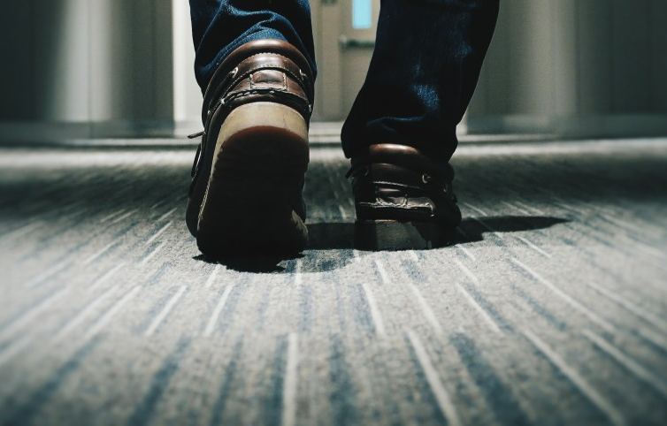
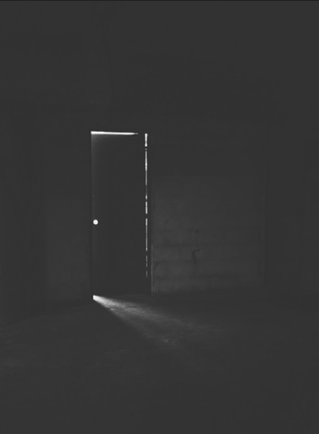

# Spooky Noises
The house goes back into a blissful silence, but nothing lasts forever. All of a sudden, you hear heavy footsteps echoing in the hallway followed by the creak of an opening door. You don't seem to think they are a big deal until you realize that no one is home except your brother. And it can't be him because he would never walk about the house in the dark...  
Now you're awake and slightly worried.

[Should you check you're brother's room?](where-are-you.md)  
[**Stomach growls** Now that you think of it, you are a little hungry. Will you stop by the kitchen first to grab a snack?](kitchen.md)

  
_Credit to [CC0 Public Domain](https://pxhere.com/en/photo/1179638)_  
  
_Credit to [Cristian Menghi](https://www.flickr.com/photos/cmenghi/)_
